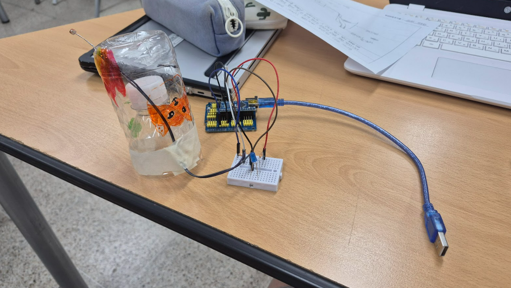

# 🌱 에코아트 프로젝트: [페트병 빛 감지기]

## 📖 프로젝트 개요
- **제작자**: [안수연]
- **제작일**: [7/15]
- **소개**
> 우리 작품이 어떤 환경 문제를 다루고 있는지, 어떤 메시지를 전달하고 싶은지 자유롭게 설명해주세요.
> (예: 저희는 버려지는 플라스틱 쓰레기 문제의 심각성을 알리기 위해...)
- 이 작품은 버려진 페트병을 활용해 만든 친환경 교육용 장치입니다. 투병 페트병 안에 **빛 센서(포토센서)**를 설치하고, 그 센서가 주변의 밝기를 감지하면 아두이노가 이를 분석해, 빛이 부족할 경우 LED를 켜서 "햇빛이 부족하다"는 메시지를 시각적으로 표현한다. 재활용 실천, 에너지 인식, 환경 감수성을 높이는데 목적이 있으며, 환경 문제를 직접 체험하며 이해할 수 있도록 돕는 도구로서의 가치를 가진다.
## 📦 사용 재료
- 아두이노, 포토센서, LED, 브레드보드
- 페트병, 그림 도안 등

## 🔧 제작 과정

### 1단계: 아이디어 스케치

- 아이디어 설명: 투명 페트병 안에 빛 센서를 설치해 주면 밝기를 측정하고, 아두이노가 그 신호를 받아 빛이 부족할 때 LED를 켜서 "햇빛이 부족하다"는 메시지를 눈으로 쉽게 알 수 있게 만드는 친환경 교육용 모형 장치이다.
- 예상 완성도

### 2단계: 완성품

## 💭 제작 후기
### 잘된 점
- 간단한 재료로 아두이노 환경 작품을 직접 만들 수 있었다는 점이 가장 만족스러웠고, 페트병을 활용해 외형을 꾸미고 LED와 연결했을 때, 원하는 반응이 실제로 나오는 것이 신기하고 뿌듯했다. 그리고 회로 연결과 LED 동작이 처음 예상한 대로 잘 작동해서 자신감이 생겼다. 

### 아쉬운 점
- 외부 조도나 센서 값이 일정하지 않아 LED가 의도치 않게 깜빡이거나 반응이 약할 때가 있었다. 그리고 페트병을 자르거나 고정하는 과정이 다소 불편했고, 안정적으로 고정하는 데 시간이 걸렸다. 

### 개선할 점
- 

### 내가 이미 알고 있었던 것
- 

### 새롭게 배운게 된 것
- 

### 더 알고 싶은 것
- 

## 🌍 환경적 의미
- 이 작품이 환경에 미치는 긍정적 영향
- 사용한 재활용 재료가 환경에 미치는 의미
- 앞으로의 환경 보호 다짐 등

## 📚 참고 자료
- [환경 관련 웹사이트](링크)
- [참고한 에코아트 작품](링크)

## 🏷️ 태그
#에코아트 #재활용 #환경보호 #DIY #창의활동

---

> 이 프로젝트는 환경 보호와 창의적 사고를 위한 교육 목적으로 제작되었습니다.
